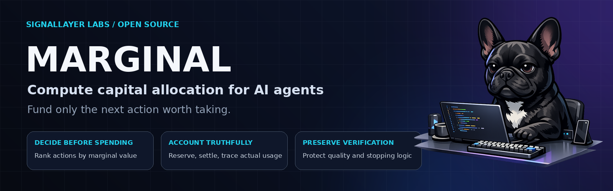

<div align="center">



# MARGINAL

### Evidence-based compute governance for AI agents

**MARGINAL watches agent work, detects proven no-progress repetition, and earns limited authority to stop it.**

Open source · Local first · Provider neutral · Zero mandatory runtime dependencies

[Quickstart](docs/getting-started/quickstart.md) · [Architecture](docs/product/architecture.md) ·
[Evidence standard](docs/evaluation/governance-evidence.md) · [Roadmap](ROADMAP.md) · [Contributing](CONTRIBUTING.md)

[](https://github.com/SignalLayerLabs/Marginal/actions/workflows/ci.yml)
[](https://github.com/SignalLayerLabs/Marginal/actions/workflows/codeql.yml)
[](https://github.com/SignalLayerLabs/Marginal/releases)
[](https://www.python.org/)
[](LICENSE)

</div>

---

## What MARGINAL does

- Observes tool actions, outcomes, workspace state, and new evidence.
- Distinguishes useful repetition from the same successful action repeated without progress.
- Records decisions in a verifiable, hash-chained Decision Ledger.
- Grants authority gradually and removes it when evidence, identity, capability, or integrity changes.

MARGINAL does not assume that more calls are wasteful. Missing or ambiguous evidence fails open.

## Install for Codex

Install the native plugin from the repository:

```bash
codex plugin marketplace add SignalLayerLabs/Marginal --ref main
codex plugin add marginal@marginal
```

The plugin starts globally in **Shadow Mode**. Open `/hooks` in Codex and approve the exact hook
definitions after inspection. One local Python 3.10–3.13 interpreter is required; the launcher can
find a compatible interpreter even when macOS resolves `python3` to an older Xcode runtime.

Remove the plugin with:

```bash
codex plugin remove marginal@marginal
```

If the Python package is installed, the equivalent installer can also record explicit Autopilot
consent:

```bash
marginal install codex --autopilot-consent
```

Installation alone never enables enforcement. Earned Enforcement requires verified evidence and
explicit promotion.

## How Autopilot works

1. **Observe.** Hooks collect derived state, outcome, and coverage signals in Shadow Mode.
2. **Verify.** Decision Receipts bind the decision, policy, trust state, and governance cost.
3. **Earn authority.** Promotion requires explicit consent, a valid receipt, and a verified ledger range.
4. **Intervene narrowly.** Only an exact eligible action with two prior successes and no state or evidence change can be denied on the third attempt.
5. **Recover.** An immediate retry is allowed after a deny. Failures, unknown outcomes, drift, or integrity errors demote authority and fail open.

Authority is contextual, not permanent. The Trust Engine evaluates sample size, coverage, harmful
outcomes, regret, governance tax, recency, policy identity, and available adapter capabilities.

## User intent and controls

Codex user prompts can express deliberate repeat intent in English or Italian, including `repeat`,
`force`, and `ripeti`. Negated or ambiguous phrases fail open. The prompt is processed in memory;
its text and hash are not written to evidence.

With the Python CLI:

```bash
marginal status --json
marginal doctor --json
marginal explain DECISION_ID --json
marginal privacy inspect --json
```

- `status` separates configured mode from effective authority and lists promotion blockers.
- `doctor` checks runtime, hooks, schemas, policy identity, ledger integrity, and file permissions.
- `explain` returns the redacted evidence behind one decision.
- `privacy inspect` lists every persisted data category.

The bundled `$marginal` skill exposes native `status`, `doctor`, `review`, `promote`, and `demote`
operations without requiring a global executable.

## Enforcement boundary

The current Codex integration provides **Tool Enforcement**, not Full Compute Enforcement.

| Action family | Current behavior |
|---|---|
| Absolute workspace-local `Read` / `read_file` with only a path argument | Eligible after verified repeated success and no progress |
| User-requested repeat or force | Allowed |
| Polling, waiting, failure, or unknown outcome | Allowed |
| Changed workspace state or evidence | Allowed and repetition proof reset |
| Generic shell, tests, or search | Observe/recommend only |
| Writes, network, deploy, external APIs, unknown MCP | Observe/recommend only |
| MARGINAL status, doctor, demote, and recovery | Trusted control-plane bypass |

MARGINAL counts actual avoided actions and recoveries. It does not invent token savings for actions
that did not run.

## Privacy and integrity

- Raw prompts, source, commands, outputs, transcripts, and credentials are not evidence fields.
- Private local keys produce domain-separated pseudonyms for low-entropy identifiers.
- The v3 governance ledger links every canonical record to the previous record hash.
- Promotion reads verified ledger payloads, not mutable summary files.
- Ledger files use owner-only permissions, file locking, no-follow opens, and non-destructive quarantine.
- Integration errors demote enforcement and allow the requested tool action.
- `SAFE_TELEMETRY` exports derived pseudonyms and approved measurements, never raw private payloads.
- `AGGREGATE_EXPORT` publishes only grouped statistics that meet the configured minimum group size.

Read the [privacy model](docs/operations/privacy.md) and
[governance evidence standard](docs/evaluation/governance-evidence.md).

## Measured evidence

**Exploratory 3-task smoke, one paired run per task.** This SWE-bench Lite result validates the
integration path; it does not establish performance.

| Metric | Codex OFF | Codex + MARGINAL | Observed change |
|---|---:|---:|---:|
| Verified tasks resolved | 0/3 | 0/3 | 0/3 → 0/3 |
| Effective tokens | 1,098,747 | 824,839 | 24.93% fewer |
| Effective latency | 593.11 s | 565.77 s | 4.61% lower |
| Tool calls | 33 | 32 | 3.03% fewer |
| Governance overhead | — | 0 tokens · $0 · 7.06 s | measured separately |
| Evaluator decision | — | `pass_through` | no support claim |

The observed token difference is 24.93%, but neither lane resolved a task.

**No deny was applied in these three agent trajectories.** The difference therefore cannot be
attributed to MARGINAL and is not a useful-token-saving claim. Tokens per resolved task remain
undefined.

[Public report](benchmarks/swebench_lite/PUBLIC_BENCHMARK.md) · [Raw JSON](benchmarks/swebench_lite/public-benchmark.json) ·
[Evidence bundle](benchmarks/swebench_lite/evidence/smoke-2026-08-11-dbce533/) · [Protocol](benchmarks/swebench_lite/README.md)

## Python library

Install the current tagged version:

```bash
pip install "marginal-ai @ git+https://github.com/SignalLayerLabs/Marginal.git@v0.3.3"
```

Minimal Shadow Mode example:

```python
from marginal import BudgetLimits, Treasury, build_policy

treasury = Treasury(
    BudgetLimits(max_tokens=100_000, max_usd=2.00),
    policy=build_policy("balanced"),
    mode="shadow",
)
```

Start new integrations in Shadow Mode. Promote only after representative evidence shows that the
policy preserves verified quality.

## Architecture

```text
Agent adapters
      │
Universal Agent Protocol
      │
      ├── Treasury and policy
      ├── progress and utility evidence
      ├── Trust Engine and authority levels
      └── Decision Receipts and governance ledger
```

Adapters own native interception. The provider-neutral core owns policy, accounting, trust, and
evidence semantics. See the [architecture guide](docs/product/architecture.md).

## Documentation

| Area | Start here |
|---|---|
| Getting started | [Quickstart](docs/getting-started/quickstart.md) |
| Product | [Concepts](docs/product/concepts.md) · [Architecture](docs/product/architecture.md) |
| Codex | [Plugin guide](docs/integrations/codex.md) · [Benchmark readiness](docs/integrations/codex-benchmark-readiness.md) |
| Evaluation | [Benchmarking](docs/evaluation/benchmarking.md) · [Public benchmarks](docs/evaluation/public-benchmarks.md) |
| Operations | [Privacy](docs/operations/privacy.md) · [Governance](docs/project/governance.md) |
| Reference | [API](docs/reference/api.md) · [Roadmap](ROADMAP.md) |

## Contributing

Contributions and falsifiable criticism are welcome. Performance changes should include the
evidence that could prove them wrong.

```bash
ruff format --check .
ruff check .
mypy src/marginal
pytest -q
```

Read [CONTRIBUTING.md](CONTRIBUTING.md).

## License

Apache-2.0. See [LICENSE](LICENSE).
