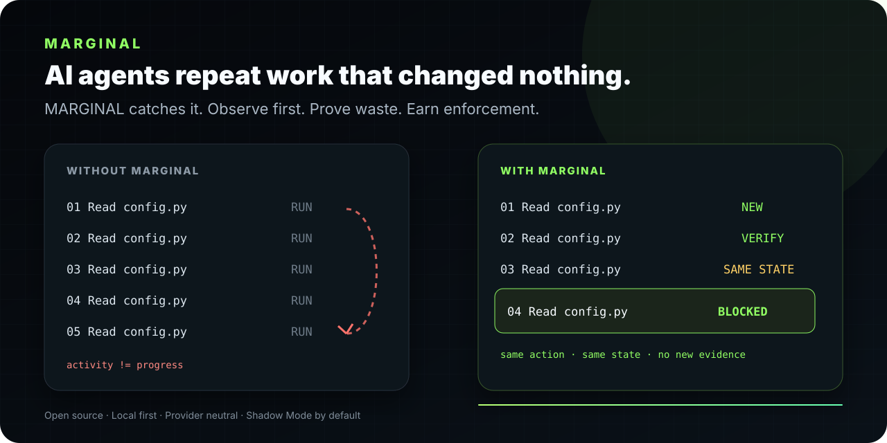

<div align="center">



# MARGINAL

## AI agents repeat work that changed nothing. **MARGINAL catches it.**

**Open-source runtime governor for AI coding agents.** MARGINAL observes agent work, detects proven no-progress repetition, and only earns limited authority to stop it after enough local evidence.

### **Observe first. Prove waste. Earn enforcement.**

Open source · Local first · Provider neutral · Zero mandatory runtime dependencies

[**Try the visual demo →**](https://signallayerlabs.github.io/Marginal/#demo) · [Quickstart](docs/getting-started/quickstart.md) · [Architecture](docs/product/architecture.md) · [Evidence standard](docs/evaluation/governance-evidence.md)

[](https://github.com/SignalLayerLabs/Marginal/actions/workflows/ci.yml)
[](https://github.com/SignalLayerLabs/Marginal/actions/workflows/codeql.yml)
[](https://github.com/SignalLayerLabs/Marginal/releases)
[](https://www.python.org/)
[](LICENSE)
[](https://github.com/systempromptio/awesome-ai-agent-governance)

</div>

---

## The problem in one trace

```text
WITHOUT MARGINAL                 WITH MARGINAL

Read config.py    RUN            Read config.py    NEW EVIDENCE
Read config.py    RUN            Read config.py    VERIFY
Read config.py    RUN            Read config.py    SAME STATE
Read config.py    RUN            Read config.py    STOP CANDIDATE
Read config.py    RUN            ...               BLOCK only if earned
```

MARGINAL does **not** assume that repetition is waste. Another read, test, or verification can be exactly what a risky task needs. It looks for a stronger pattern: **the same eligible successful action, unchanged observable state, and no new evidence**.

> **Installation is not permission to block your agent.** New integrations start in Shadow Mode. Enforcement has to be earned from evidence and can be removed again when evidence, identity, capability, coverage, or integrity changes.

## Install for Codex

```bash
codex plugin marketplace add SignalLayerLabs/Marginal --ref main
codex plugin add marginal@marginal
```

Open `/hooks` and inspect the exact MARGINAL lifecycle hooks before granting trust. The plugin starts globally in **Shadow Mode**.

```bash
codex plugin remove marginal@marginal
```

With the Python package, explicit Autopilot consent can be recorded with:

```bash
marginal install codex --autopilot-consent
```

## How MARGINAL earns authority

1. **Observe** — collect derived action, outcome, coverage, state and evidence signals locally.
2. **Verify** — bind decisions, policy identity, trust state and governance cost into Decision Receipts.
3. **Earn** — require representative local evidence, clean coverage and explicit promotion.
4. **Intervene narrowly** — only exact eligible actions can be denied under the proven no-progress condition.
5. **Recover** — immediate retry is allowed; drift, unknown outcomes or failures demote authority and fail open.

### Optional Commons modes

Commons is **Local Only by default** for new and existing installations. An explicit Python
installer choice can enable one of two network postures:

```bash
marginal install codex --commons-mode read_only
marginal install codex --commons-mode contributor
```

Read-Only downloads a bounded, verified model-specific aggregate pack. Contributor also sends only
closed-schema aggregate counts for an exact reviewed public model; it sends no prompt, source,
command, output, repository data, local hash, timestamp, or persistent contributor identity. A
one-time retry token exists only in an HTTP header. Commons data is a prior only and cannot affect
local trust, promotion, Autopilot, or Tool Enforcement. Network failures fail open.

Contributor transport uses Cloudflare infrastructure, whose processing of network-layer metadata is
outside MARGINAL's application boundary. The production contribution endpoint is not active until
Wrangler authentication and a dedicated least-privilege GitHub service credential are both
verified. See the [privacy model](docs/operations/privacy.md).

## Current integrations

| Engine | Capability | Current behavior |
|---|---|---|
| **Codex** | **Tool Enforcement** | Native plugin. Shadow Mode first; narrow blocking requires repository-local Earned Enforcement evidence. |
| **Claude Code** | **Observe-only** | Native hooks record engine-declared success/failure and recommendations; they do not alter the next action. |
| **OpenCode** | **Observe-only** | JavaScript plugin + persistent stdio bridge to the provider-neutral runtime. |
| **PrivacyCode** | **Observe-only** | OpenCode-compatible target with a distinct engine identity, ledger root and trust history. |

Same adapter does **not** mean same trust. Enforcement evidence stays engine- and repository-specific.

### Claude Code
```bash
marginal install claude-code
marginal uninstall claude-code
```

### OpenCode
```bash
marginal install opencode
marginal uninstall opencode
```

### PrivacyCode
```bash
marginal install privacycode
marginal uninstall privacycode
```

See the [integration overview](docs/integrations/overview.md), [Claude Code guide](docs/integrations/claude-code.md), and [OpenCode / PrivacyCode guide](docs/integrations/opencode.md).

## Current enforcement boundary

The Codex integration provides **Tool Enforcement**, not Full Compute Enforcement.

| Action family | Current behavior |
|---|---|
| Absolute workspace-local `Read` / `read_file` with only a path argument | Eligible after verified repeated success and no progress |
| User-requested repeat or force | Allowed |
| Polling, waiting, failure, or unknown outcome | Allowed |
| Changed workspace state or evidence | Allowed; repetition proof resets |
| Generic shell, tests, or search | Observe/recommend only |
| Writes, network, deploy, external APIs, unknown MCP | Observe/recommend only |
| MARGINAL status, doctor, demote, and recovery | Trusted control-plane bypass |

MARGINAL counts actual avoided actions and recoveries. It does not invent token savings for actions that did not run.

## Privacy and integrity

- Raw prompts, source, commands, outputs, transcripts, and credentials are not evidence fields.
- Private local keys produce domain-separated pseudonyms for low-entropy identifiers.
- The v3 governance ledger links every canonical record to the previous record hash.
- Promotion reads verified ledger payloads, not mutable summary files.
- Ledger files use owner-only permissions, file locking, no-follow opens, and non-destructive quarantine.
- Integration errors demote enforcement and allow the requested action.
- `SAFE_TELEMETRY` exports derived pseudonyms and approved measurements, never raw private payloads.
- `AGGREGATE_EXPORT` publishes only grouped statistics that meet the configured minimum group size.
- Optional Commons sharing remains Local Only unless the user explicitly selects Read-Only or
  Contributor; shared Commons priors never grant enforcement authority.

Read the [privacy model](docs/operations/privacy.md) and [governance evidence standard](docs/evaluation/governance-evidence.md).

## Controls

```bash
marginal status --json
marginal doctor --json
marginal explain DECISION_ID --json
marginal privacy inspect --json
```

The bundled `$marginal` skill also exposes native `status`, `doctor`, `review`, `promote`, and `demote` operations.

## Public evidence

### Exploratory SWE-bench Lite smoke

**Exploratory 3-task smoke, one paired run per task.** The first measured Codex integration validated the integration path; it did **not** establish performance.

| Metric | Codex OFF | Codex + MARGINAL | Observed change |
|---|---:|---:|---:|
| Verified tasks resolved | 0/3 | 0/3 | 0/3 → 0/3 |
| Effective tokens | 1,098,747 | 824,839 | 24.93% fewer observed |
| Effective latency | 593.11 s | 565.77 s | 4.61% lower observed |
| Tool calls | 33 | 32 | 3.03% fewer observed |
| Governance overhead | — | 0 tokens · $0 · 7.06 s | measured separately |
| Evaluator decision | — | `pass_through` | no support claim |

**Important:** neither lane resolved a task. **No deny was applied in these three agent trajectories.** The observed 24.93% token difference therefore cannot be attributed to MARGINAL and is not a token-saving claim.

[Public report](benchmarks/swebench_lite/PUBLIC_BENCHMARK.md) · [Raw JSON](benchmarks/swebench_lite/public-benchmark.json) · [Evidence bundle](benchmarks/swebench_lite/evidence/smoke-2026-08-11-dbce533/) · [Protocol](benchmarks/swebench_lite/README.md)

## Python library

```bash
pip install "marginal-ai @ git+https://github.com/SignalLayerLabs/Marginal.git@v0.3.3"
```

```python
from marginal import BudgetLimits, Treasury, build_policy

treasury = Treasury(
    BudgetLimits(max_tokens=100_000, max_usd=2.00),
    policy=build_policy("balanced"),
    mode="shadow",
)
```

## Architecture

```text
Agent adapters
      │
Universal Agent Protocol
      │
      ├── Treasury and policy
      ├── progress and utility evidence
      ├── Trust Engine and authority levels
      └── Decision Receipts and Decision Ledger
```

Adapters own native interception. The provider-neutral core owns policy, accounting, trust and evidence semantics. See the [architecture guide](docs/product/architecture.md).

## Documentation

| Area | Start here |
|---|---|
| Getting started | [Quickstart](docs/getting-started/quickstart.md) |
| Product | [Concepts](docs/product/concepts.md) · [Architecture](docs/product/architecture.md) |
| Codex | [Plugin guide](docs/integrations/codex.md) · [Benchmark readiness](docs/integrations/codex-benchmark-readiness.md) |
| Claude Code | [Observe plugin](docs/integrations/claude-code.md) |
| OpenCode / PrivacyCode | [Observe plugin and compatible targets](docs/integrations/opencode.md) |
| Evaluation | [Benchmarking](docs/evaluation/benchmarking.md) · [Public benchmarks](docs/evaluation/public-benchmarks.md) |
| Operations | [Privacy](docs/operations/privacy.md) · [Governance](docs/project/governance.md) |
| Reference | [API](docs/reference/api.md) · [Roadmap](ROADMAP.md) |

## Contributing

Contributions and falsifiable criticism are welcome. Performance changes should include the evidence that could prove them wrong.

```bash
ruff format --check .
ruff check .
mypy src/marginal
pytest -q
```

Read [CONTRIBUTING.md](CONTRIBUTING.md).

## License
Apache-2.0. See [LICENSE](LICENSE).
