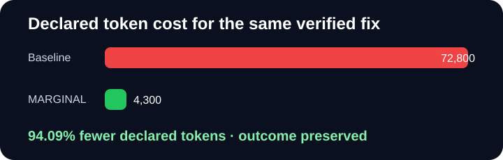

# MARGINAL Killer Demo

**Fund only the next action worth taking.**

> Deterministic functional demonstration using declared action-cost estimates; not provider telemetry, not a production benchmark, and not a claim about every agent workload.

Scenario: **Fix a percentage-discount bug in a deterministic Python repository**



## The defect

```diff
- return total - rate
+ return total * (1 - rate)
```

Verifier: `apply_discount(100.0, 0.20) == 80.0`

Initial verifier: **FAIL**

| Metric | Baseline: run everything | MARGINAL | Savings |
|---|---:|---:|---:|
| Declared tokens | 72,800 | 4,300 | **94.09%** |
| Calls | 9 | 3 | **66.67%** |
| Estimated USD | $0.763 | $0.026 | **96.59%** |
| Estimated latency | 22,030 ms | 1,230 ms | **94.42%** |
| Verified outcome | PASS | PASS | preserved |

## Allocation decisions

### Diagnose

Funded: **inspect the failing assertion** — approved: marginal ROI 7.166

| Candidate | Declared tokens | Expected gain | Score | Decision |
|---|---:|---:|---:|---|
| inspect the failing assertion | 1,200 | 0.220 | 0.189 | FUNDED: approved: marginal ROI 7.166 |
| scan the entire repository | 9,000 | 0.050 | -0.179 | SKIPPED: rejected: marginal ROI 0.218 below 1.000 |
| ask two parallel reviewers | 14,000 | 0.040 | -0.369 | SKIPPED: rejected: marginal ROI 0.098 below 1.000 |

### Fix

Funded: **apply the targeted one-line patch** — approved: marginal ROI 7.418

| Candidate | Declared tokens | Expected gain | Score | Decision |
|---|---:|---:|---:|---|
| apply the targeted one-line patch | 2,400 | 0.500 | 0.433 | FUNDED: approved: marginal ROI 7.418 |
| rewrite the complete pricing module | 12,000 | 0.200 | -0.156 | SKIPPED: rejected: marginal ROI 0.561 below 1.000 |
| ask a frontier model for an alternative patch | 18,000 | 0.150 | -0.501 | SKIPPED: rejected: marginal ROI 0.230 below 1.000 |

### Verify

Funded: **run the targeted verifier** — approved: marginal ROI 21.394

| Candidate | Declared tokens | Expected gain | Score | Decision |
|---|---:|---:|---:|---|
| run the targeted verifier | 700 | 0.350 | 0.334 | FUNDED: approved: marginal ROI 21.394 |
| run the full test suite | 4,500 | 0.080 | -0.025 | SKIPPED: rejected: marginal ROI 0.763 below 1.000 |
| request a premium model audit | 11,000 | 0.050 | -0.348 | SKIPPED: rejected: marginal ROI 0.126 below 1.000 |

## Reproduce

```bash
marginal killer-demo --output killer-demo-output
```

The command writes this report, a standalone HTML report, an SVG comparison, the JSON result, and the provider-neutral decision trace.
