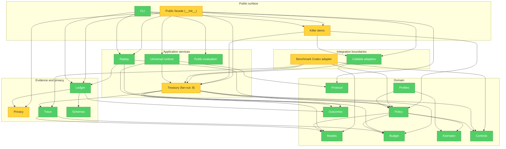

# Brooks-Lint Review

**Mode:** Architecture Audit  
**Scope:** `src/marginal`, `benchmark/codex_adapter`, packaging, CLI, and evidence boundaries  
**Health Score:** 79/100

MARGINAL has a coherent provider-neutral domain core and no dependency cycles, but its public
facade and a few oversized modules will become change-propagation hotspots unless the production
Codex integration is introduced behind a strict adapter boundary.

---

## Module Dependency Graph

---

## Findings

### 🟡 Warning

**Change Propagation — The public facade imports the whole product**  
Symptom: `src/marginal/__init__.py` imports across more than five domain and infrastructure
modules, including the 2,357-line `killer_demo.py` module. See the yellow `Facade` and `Demo`
nodes above.  
Source: Martin — Clean Architecture, Stable Dependencies Principle; Fowler — Shotgun Surgery.  
Consequence: importing the lightweight core couples users to demo and reporting changes, while a
new integration risks increasing import time and widening the regression surface.  
Remedy: keep Codex modules out of the top-level facade, lazy-load demo commands, and expose the
integration through `marginal.integrations.codex` plus CLI dispatch only.

**Dependency Disorder — Treasury is the central blast-radius hotspot**  
Symptom: `Treasury` depends on budget, policy, controls, models, outcomes, execution modes, and
trace infrastructure. It is the only node with fan-out greater than five.  
Source: Martin — Clean Architecture, Stable Dependencies Principle; Brooks — Conceptual
Integrity.  
Consequence: embedding Codex lifecycle or installation behavior in `Treasury` would make vendor
changes propagate into the economic core.  
Remedy: preserve `Treasury` as provider-neutral orchestration and translate every Codex event at
the adapter boundary before calling it.

**Accidental Complexity — The demo is larger than the production modules**  
Symptom: `killer_demo.py` contains 2,357 lines and is imported by the public facade even though it
is a non-runtime demonstration artifact.  
Source: Brooks — The Second-System Effect; Fowler — Large Class.  
Consequence: presentation code dominates navigation and raises the cost of understanding the
installable library.  
Remedy: exclude demo internals from the Codex plugin artifact, lazy-load them from the CLI, and
schedule a separate extraction into a demo package rather than mixing that refactor into v0.3.

**Knowledge Duplication — The benchmark adapter could become a second implementation**  
Symptom: `benchmark/codex_adapter` already contains normalization, hook transport, daemon, and
state hashing, but it is intentionally outside the installed package. See the yellow
`BenchmarkCodex` node.  
Source: Hunt & Thomas — DRY; Evans — Anti-Corruption Layer.  
Consequence: copying those files into `src/` would create two economic interpretations that drift
on outcome classification, capability labels, and failure handling.  
Remedy: implement one production adapter under `src/marginal/integrations/codex`; make benchmark
code consume its stable normalization and hook-contract components where scientifically valid,
while keeping experiment orchestration in `benchmark/`.

### 🟢 Suggestion

**Cognitive Overload — Privacy remains a large single-module boundary**  
Symptom: `privacy.py` has 804 lines covering classification, pseudonymization, sanitization, key
management, and aggregation.  
Source: McConnell — High-Quality Routines; Fowler — Divergent Change.  
Consequence: adding plugin-specific persistence there would mix local runtime storage with export
privacy and increase review load.  
Remedy: keep Codex persistence in the integration package and use existing privacy contracts
without adding plugin storage responsibilities to `privacy.py`.

---

## Summary

The provider-neutral dependency direction is sound and no cycle was found. The decisive action is
to extract, not copy, the reusable Codex boundary and to keep plugin lifecycle, persistence, and
installation outside `Treasury`, `Privacy`, and the top-level facade. Team structure is not
documented, so the Conway's Law check is intentionally not scored.

