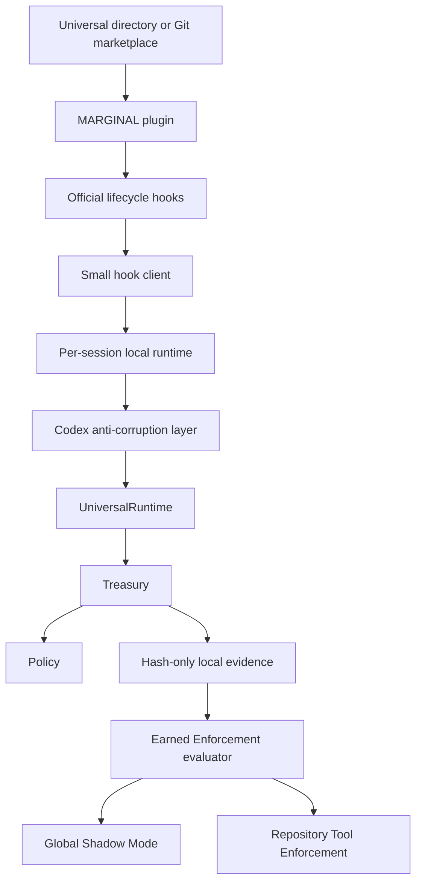

# MARGINAL Codex Plugin and Earned Enforcement Design

**Status:** Approved product direction; implementation checkpoint  
**Date:** 2026-08-13  
**Target milestone:** v0.3 — Codex Reference Integration

## 1. Purpose

Ship a production Codex integration that anyone can install and remove through native Codex plugin
workflows, while preserving MARGINAL's evidence-first standard.

The differentiating product contract is **Earned Enforcement**:

> MARGINAL starts as an observer. It earns the right to block tool actions for one repository only
> after it can prove that its own coverage, recommendations, false-stop review, and overhead meet a
> versioned local evidence gate.

This is not a claim that MARGINAL is the first budget limiter, cost dashboard, loop detector, or
agent hook. Those categories already exist. The product distinction is the combination of:

- marginal-value allocation rather than a hard cap alone;
- state/evidence-aware progress analysis;
- quality, false-stop, and governance-tax accounting;
- a capability label that refuses to overstate the native control surface;
- automatic demotion when the evidence contract no longer holds;
- native, reversible distribution with local-first telemetry.

## 2. Goals

1. Make the public Codex plugin the canonical installation surface.
2. Provide an immediate GitHub marketplace fallback before OpenAI review completes.
3. Keep global installation non-blocking in Shadow Mode.
4. Allow repository-scoped Tool Enforcement only through Earned Enforcement.
5. Make install, update, status, diagnostics, demotion, and uninstall idempotent and auditable.
6. Reuse the provider-neutral runtime and avoid a second policy implementation.
7. Persist hashes and structured decisions locally without storing prompts, source, raw commands,
   or raw tool output by default.
8. Produce a plugin bundle, submission materials, positive/negative tests, and public legal/support
   pages suitable for the universal Plugins Directory.
9. Preserve a thin engine boundary that can later support Claude Code without changing economic
   policy.

## 3. Non-goals

- Claiming Full Compute Enforcement when Codex hooks do not cover every model or hosted-tool path.
- Parsing session transcripts as a stable API.
- Silently trusting hooks or using `--dangerously-bypass-hook-trust` for users.
- Reading or copying Codex authentication files.
- Uploading prompts, source, commands, outputs, or local telemetry.
- Automatically claiming token savings from tool-call suppression.
- Replacing the frozen benchmark adapter with unvalidated production assumptions.
- Solving multi-engine installation in v0.3; the architecture must permit it, but Codex is the
  release target.

## 4. Product capability label

The v0.3 adapter reports **Tool Enforcement** when all required hooks are trusted and observed.

It does not report Full Compute Enforcement because official Codex documentation says specialized
tool paths can opt out and hosted tools do not use the local hook path. The capability report lists
each supported event and tool family rather than collapsing support into one boolean.

Required events:

- `SessionStart` for runtime startup and capability attestation;
- `PreToolUse` for allow/recommend/deny decisions;
- `PostToolUse` for completion evidence and state correlation;
- `SessionEnd` for settlement, coverage summary, and clean shutdown.

Optional later events include `Stop`, `SubagentStart`, and `SubagentStop`. They are not part of the
first enforcement gate.

## 5. User experience

### 5.1 Public directory

Once OpenAI approves and the publisher releases it, users install MARGINAL from the universal
Plugins Directory shared by ChatGPT and Codex. The directory listing is the primary product route.

Submission starts immediately when the implementation, legal pages, test cases, and final bundle
pass their gates. Public appearance cannot be represented as immediate because OpenAI approval is
an external review step.

### 5.2 Immediate GitHub marketplace fallback

Before directory approval, the supported one-line installation target is:

```bash
codex plugin marketplace add SignalLayerLabs/Marginal --ref main && codex plugin add marginal@marginal
```

The marketplace name in `.agents/plugins/marketplace.json` is `marginal`. Repeating the command is
safe: existing marketplace/plugin state is detected and upgraded rather than duplicated.

Removal target:

```bash
codex plugin remove marginal@marginal
```

Removing the marketplace itself is optional and separate because it may later distribute more
SignalLayer Labs plugins.

### 5.3 Python management CLI

The package also provides:

```text
marginal install codex
marginal codex status
marginal codex doctor
marginal codex review
marginal codex promote
marginal codex demote
marginal uninstall codex
```

`marginal install codex` delegates plugin registration to the Codex CLI instead of editing Codex
configuration directly. It is a secondary automation path, not a competing installation system.

The plugin remains functional without a separately installed wheel because its release artifact
contains a generated, dependency-free Python runtime. The CLI and plugin artifact are built from
the same source modules; generated plugin runtime files are never edited manually.

### 5.4 Hook trust

Codex requires review of non-managed command hooks. MARGINAL surfaces the exact `/hooks` review
step after installation and remains visibly inactive until trust is granted. It never bypasses this
security boundary.

## 6. Runtime architecture



### 6.1 Source boundaries

Production code lives under `src/marginal/integrations/codex/`:

- `capabilities.py`: Codex version, feature, hook, and tool-family capability reporting;
- `events.py`: strict official hook input/output values;
- `normalization.py`: native event to Universal Agent Protocol translation;
- `outcomes.py`: success/failure/unknown classification without undocumented guesses;
- `runtime.py`: one session's adapter and Treasury lifecycle;
- `transport.py`: authenticated local client/runtime messages;
- `service.py`: per-session process startup, health, shutdown, and crash evidence;
- `evidence.py`: coverage counters, redacted ledger, checkpoints, and receipts;
- `promotion.py`: Earned Enforcement evaluation and automatic demotion;
- `installer.py`: Codex CLI detection and idempotent plugin operations;
- `commands.py`: Codex-specific CLI handlers.

The generic CLI only dispatches to this package. The top-level `marginal` facade does not import
Codex integration modules.

`benchmark/codex_adapter` keeps experiment orchestration, pinned task containers, and frozen run
records. It imports stable production event/normalization contracts when doing so does not change
the frozen scientific definition. Production never imports from `benchmark`.

### 6.2 Plugin package

The repository contains:

```text
.agents/plugins/marketplace.json
plugins/marginal/
  .codex-plugin/plugin.json
  hooks/hooks.json
  skills/marginal/SKILL.md
  scripts/marginal_hook.py
  runtime/marginal_runtime.pyz
  assets/
```

The plugin runtime zipapp is reproducibly generated from selected `src/marginal` modules. CI fails
if the committed bundle and source tree differ. Release provenance records source commit, Python
version, manifest hash, and bundle SHA-256.

### 6.3 Per-session service

`SessionStart` launches one local service per Codex session. It binds only to loopback, selects an
ephemeral port, and authenticates every hook call with a random 256-bit token stored in a
user-private connection file under `PLUGIN_DATA`.

The service:

- owns the in-memory Treasury and pending-action map;
- serializes lifecycle mutations;
- writes an atomic checkpoint after every settled decision;
- can restore completed observation history after a safe restart;
- marks interrupted pending actions as unknown rather than successful;
- reports health and coverage independently from policy decisions;
- shuts down on `SessionEnd` and removes connection credentials.

Loopback transport is chosen over Unix-only sockets so the same design works on macOS, Linux,
WSL, and native Windows. File permissions are restrictive where the platform supports POSIX modes;
Windows uses the current-user data directory and never places connection material in a repository.

## 7. Event and outcome semantics

### 7.1 Identity

Each action uses:

- Codex `session_id`, `turn_id`, and `tool_use_id` for lifecycle identity;
- normalized tool name and canonicalized input hash for semantic identity;
- repository state hash excluding `.git`, `.codex`, `.marginal`, caches, virtual environments,
  plugin data, and generated runtime evidence;
- post-action evidence hash derived in memory from `tool_response`.

Raw tool input and response are not persisted by default.

### 7.2 Success is not completion

Official `PostToolUse` is a completion signal and also runs after non-zero shell exits. Therefore
the adapter uses an explicit outcome enum:

- `success`: supported structured evidence proves success;
- `failure`: supported structured evidence proves failure;
- `unknown`: Codex completed the handler but the supported contract cannot prove the result.

Only `success` advances the existing `DiminishingReturnDetector`. `failure` uses failure
settlement; `unknown` releases or settles conservatively without advancing successful repetition
history. The adapter never treats all shell calls as successful and never classifies all shell calls
as failed.

Version-pinned parsers may be added only with captured real fixtures for success, non-zero exit,
background completion, and transport failure. Undocumented prose parsing cannot enable
enforcement.

### 7.3 No-progress recommendations

A separate provider-neutral **No Progress** signal may recommend against a repeated completed
attempt when semantic input, repository state, and evidence all remain unchanged. It is distinct
from successful-action diminishing returns.

No-progress signals begin as Shadow recommendations. They may become enforcement-eligible only
after their own reviewed evidence meets the promotion gate. This prevents a repeated failing test
or flaky check from silently being treated as waste.

## 8. Earned Enforcement

### 8.1 Scope

Promotion is repository-scoped and stored outside the repository under `PLUGIN_DATA`, keyed by an
HMAC of the canonical repository identity. Installing the plugin never adds project files.

### 8.2 Promotion receipt

A versioned receipt contains:

- repository pseudonym;
- Codex, plugin, adapter, policy, and estimator versions;
- hook and tool-family capability matrix;
- observation window and successful session count;
- hook-coverable calls, covered calls, gaps, and integration failures;
- recommendations by reason code;
- reviewed stop candidates and false stops;
- governance decision latency distribution;
- local governance tokens and USD when non-zero;
- unresolved or unknown outcomes;
- policy and evidence hashes;
- readiness status and machine-readable blocking reasons.

### 8.3 Default gate

The initial conservative gate requires all of the following:

- at least 100 covered tool actions across at least five completed sessions;
- at least 99% coverage of hook-coverable local tool calls;
- no integration failures or unresolved reservations in the evaluation window;
- at least five intervention candidates, all manually reviewed;
- zero reviewed false stops in the window;
- p95 local decision latency no greater than 75 ms;
- no Codex/plugin/policy version change since the evidence window began;
- only action families with an observable outcome contract are enforcement-eligible.

These thresholds are transparent safety defaults, not universal statistical proof. The receipt
states sample size and limitations. Configuration changes invalidate the receipt.

### 8.4 Promotion and demotion

`marginal codex promote` succeeds only with a ready receipt and records explicit user intent.
There is no silent auto-promotion.

The runtime automatically demotes the repository to Shadow Mode when:

- Codex, adapter, policy, or hook hashes change;
- coverage drops below the supported threshold;
- the local service crashes or a lifecycle mismatch occurs;
- a new false stop is recorded;
- the outcome contract becomes unknown for an enforced action family.

Demotion never prevents Codex from continuing. It writes a visible reason and a new receipt.

## 9. Installation transactions

The installer performs read-only discovery before mutation:

1. locate `codex` and record its exact version;
2. query stable feature flags and plugin commands;
3. validate the plugin/marketplace manifest and runtime hash;
4. inspect installed marketplace/plugin state through Codex JSON output;
5. execute the minimum required Codex command;
6. verify the installed plugin identity and enabled state;
7. run a local hook-client/service self-test without reading authentication data;
8. write an installation receipt.

No direct edit to `~/.codex/config.toml`, `hooks.json`, or authentication files occurs in the normal
plugin path. If a future compatibility fallback must edit configuration, it requires an atomic
backup, exact ownership markers, rollback on failure, and explicit capability labeling.

Uninstall delegates to `codex plugin remove`, verifies absence, and preserves local evidence by
default. `--purge-data` is a separate explicit destructive option. Reinstall and upgrade preserve
receipts but invalidate promotion when code or policy hashes change.

## 10. Failure behavior

- Shadow Mode fails open and records the coverage gap.
- Tool Enforcement also fails open on integration failure, immediately demotes to Shadow, and
  emits a visible warning. MARGINAL is an efficiency governor, not a security boundary.
- Invalid or oversized hook input is rejected by the adapter, recorded without raw payload, and
  causes demotion rather than a permanent Codex outage.
- A denied `PreToolUse` action never enters successful execution history.
- `PostToolUse` identity mismatch never settles a different reservation.
- Session shutdown marks remaining pending work unknown and reports it.

## 11. Privacy and security

- Runtime behavior is local and performs no network requests.
- No prompt, source, raw command, raw tool output, transcript, or credential is persisted by
  default.
- Commands and responses are canonicalized and hashed in memory before redacted evidence is
  written.
- `transcript_path` is never parsed because OpenAI does not define it as stable.
- Codex auth files and credential environment values are neither opened nor copied.
- Hook subprocess environments explicitly exclude credential variables where supported.
- Plugin data and connection tokens use user-private permissions.
- The service accepts authenticated loopback messages only, applies size/time limits, and uses
  constant-time token comparison.
- Plugin hooks require normal Codex trust review; bypass flags are prohibited in user guidance.
- Release artifacts include provenance and checksums, and CI scans plugin and publication bundles
  for secrets.

## 12. Claude compatibility direction

The domain policy, outcome enum, no-progress signal, promotion receipt, and evidence gate are
provider-neutral. The Codex plugin may use compatibility environment variables supplied by Codex,
but Codex-specific names remain inside the adapter.

A later Claude Code package supplies a separate native manifest and hook translator pointing to the
same generated runtime. No Claude behavior is claimed or shipped as complete in v0.3.

## 13. Verification strategy

### Unit and contract tests

- strict hook event validation and output shapes;
- canonical semantic/state/evidence hashing;
- success/failure/unknown settlement;
- no-progress separation from successful diminishing returns;
- pending identity and replay invariants;
- receipt thresholds, invalidation, promotion, and demotion;
- redaction and no-secret persistence;
- installer command planning and idempotency.

### Integration tests

- real Codex fixture capture for supported event types;
- trusted plugin install, list, update, remove, and reinstall against a temporary Codex home;
- SessionStart/service/PreToolUse/PostToolUse/SessionEnd lifecycle;
- concurrent hook calls and service crash recovery;
- macOS, Linux, Windows, and WSL command generation;
- plugin validation and marketplace ingestion;
- wheel/sdist install plus generated zipapp smoke.

### Live acceptance

On the pinned supported Codex version:

1. install from the Git marketplace command;
2. review/trust the hook definition through the supported UI;
3. run a harmless session that exercises shell, edit, and local function tools;
4. prove Shadow Mode does not block;
5. inspect status, coverage, redaction, and latency;
6. exercise a synthetic ready receipt and one controlled denial;
7. verify automatic demotion after a version/hash mismatch;
8. uninstall and verify ordinary Codex operation remains intact.

The repository test suite, Ruff, strict mypy, build, Twine, plugin validator, marketplace validator,
secret scan, and documentation/site checks must all pass before publication.

## 14. Public catalog submission

The repository ships a submission packet containing:

- final plugin bundle and manifest metadata;
- public website, support, privacy policy, and terms URLs;
- concise capability and limitation language;
- at least five positive and three negative reviewer test cases;
- release notes and policy attestations checklist;
- local test evidence and artifact hashes.

Submission is attempted through the OpenAI Platform organization with Apps Management write access
and a verified SignalLayer Labs identity. The repository may truthfully say **submitted** after the
portal accepts it, but may say **available in the universal directory** only after OpenAI approval
and publisher release.

## 15. Documentation and claims

README and site lead with the install/remove experience and Earned Enforcement contract only after
live verification passes. They must state:

- Shadow Mode is global by default;
- promotion is repository-scoped and evidence-gated;
- capability is Tool Enforcement, not Full Compute Enforcement;
- raw content stays local and is not persisted by default;
- benchmark savings remain separate from installer validation;
- directory submission status is external and timestamped.

No token-saving headline is added unless matched, verified, net evidence supports it.

## 16. Acceptance criteria

The v0.3 installation slice is complete when:

- a validated plugin and marketplace are committed;
- the GitHub one-line install and one-command removal work on a clean Codex home;
- `marginal install codex`, status, doctor, promotion/demotion, and uninstall are tested;
- install is global Shadow Mode and makes no project-code change;
- a repository cannot enter verified Tool Enforcement without a ready receipt;
- capability/version changes automatically demote enforcement;
- official hooks execute through the production adapter with exact lifecycle coverage;
- raw commands/output/auth material do not appear in the evidence store;
- package and plugin share one generated core implementation;
- full verification and live smoke pass;
- README, site, roadmap, changelog, integration docs, privacy, terms, and support are current;
- the public-directory submission packet is complete and portal submission is attempted;
- external review status is reported exactly, without implying approval.

